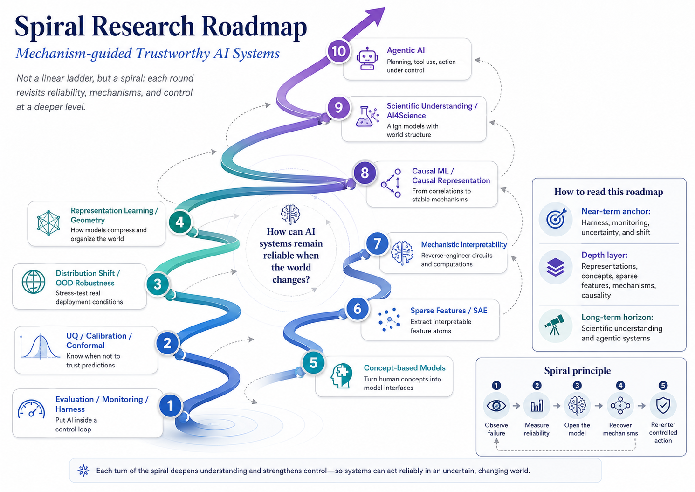

# ☁️ Hi there, I'm Hank Zhang

<p align="left">
  
</p>

<!-- DAILY-QUOTE-START -->
> **“Truth happens to an idea. It becomes true, is made true by events. Its verity is in fact an event, a process: the process namely of its verifying itself, its veri-fication. Its validity is the process of its valid-ation.”**
> — William James
> _field: psychology / philosophy · source: wikiquote_
<!-- quote-updated: 2026-08-23 -->
<!-- DAILY-QUOTE-END -->

I am interested in how learning systems form, preserve, and revise internal representations through continual experience.

My research began with a practical problem:

> **What happens when an AI model encounters data, environments, or dynamics that differ from those on which it was trained?**

My earlier work approached this problem through reliable spatiotemporal prediction under noise, missing observations, uncertainty, and distribution shift. These studies led me to a deeper question:

> **When new experience arrives, what should a model preserve, what should it adapt, and when should it reorganize its existing representation?**

My current research direction is:

# **Continual Representation Learning across Changing Environments**

I study how models can preserve latent structure shared across environments while adapting to environment-specific changes and incorporating genuinely novel factors.

My long-term interest is broader but clearly separated from the current technical problem:

> **How can learning systems build and revise internal models through continual interaction with a changing world?**

**From reliable prediction to continually revisable internal representations.**

---

<p align="center">
  
</p>

<p align="center">
  <em>
    Research develops as a spiral: practical failures expose deeper questions about learning,
    representation, memory, and generalization.
  </em>
</p>

---

## 🎓 About Me

- 🎓 Incoming M.S. in Data Science at **UC San Diego, Halıcıoğlu Data Science Institute**
- 🔄 Background:
  - Management Information Systems
  - Machine Learning and Data Science
  - Reliable and Scientific AI
- 🧭 Current research transition:

```text
Model Use
→ Model Construction
→ Reliability Analysis
→ Representation Analysis
→ Continual Representation Learning
```

- 🛠 Currently building foundations in:
  - Machine Learning and Deep Learning
  - Probability and Statistical Learning
  - Linear Algebra, Optimization, and Geometry
  - Dynamical Systems and State-space Models
  - Continual Learning and Representation Learning
  - Causal Representation Learning
  - Scientific Machine Learning
  - Philosophy of Science and Epistemology

---

# 🧭 Research Positioning

My research program is organized into four levels.

| Level | Description | Current Status |
|---|---|---|
| **Empirical Starting Point** | Reliable prediction under noise, missingness, uncertainty, and environmental change | Existing foundation |
| **Observed Problem** | Learned representations may become fragile, overwritten, or inadequate when experience changes | Research motivation |
| **Current Technical Direction** | Continual representation learning across changing environments | Main focus |
| **Long-term Scientific Interest** | How internal models are formed, preserved, revised, and expanded through continual experience | Long-term vision |

This distinction is important.

My earlier reliability work is not discarded. It provides the empirical starting point from which the current representation-learning problem emerged.

---

# 🔬 Current Research Direction

## Continual Representation Learning across Changing Environments

Continual learning studies models that receive data, tasks, or environments sequentially rather than through a single fixed training distribution.

Representation learning studies how models transform observations into internal variables:

$$
z = E_{\theta}(x),
$$

where:

- \(x\) is an observation;
- \(E_{\theta}\) is a learned encoder;
- \(z\) is an internal representation.

In a changing environment, the encoder itself evolves:

$$
E_{\theta_1}
\rightarrow
E_{\theta_2}
\rightarrow
\cdots
\rightarrow
E_{\theta_T}.
$$

The central question is not only whether old-task accuracy is retained.

It is also:

- Which latent factors remain stable?
- Which factors are specific to an environment or task?
- Which new factors must be added?
- When does representation change reflect damage?
- When does it reflect necessary conceptual revision?
- Can old and new knowledge be integrated into a compatible internal structure?

---

## Central Research Question

> **How can a model preserve latent structure shared across environments while adapting to environment-specific changes and incorporating genuinely novel factors?**

A useful conceptual decomposition is:

$$
z_t =
\left(
z_t^{\mathrm{shared}},
z_t^{\mathrm{context}},
z_t^{\mathrm{novel}}
\right).
$$

Here:

| Component | Meaning |
|---|---|
| $z_t^{\mathrm{shared}}$ | Latent state, relations, or dynamics that remain valid across environments |
| $z_t^{\mathrm{context}}$ | Environment-, task-, device-, or observation-specific information |
| $z_t^{\mathrm{novel}}$ | New factors that cannot be represented adequately by the existing model |

This decomposition is currently a research hypothesis and modeling principle, not an assumption that such factors are always uniquely recoverable.

A model may need to take different actions under different kinds of change:

| Required Response | When It Is Appropriate |
|---|---|
| **Preserve** | The underlying system is unchanged, but observation conditions differ |
| **Adapt** | The same structure is present under a new context or task |
| **Expand** | New objects, variables, states, or parameters appear |
| **Reorganize** | The previous representation is fundamentally inadequate |

---

# 🧩 How My Earlier Research Leads to This Direction

My earlier research focused on reliable spatiotemporal prediction under:

- noisy observations;
- missing sensor values;
- environmental changes;
- graph-structure uncertainty;
- nonstationary time series;
- predictive uncertainty.

The initial question was:

> When does a model become unreliable?

The deeper question became:

> Why does a model become unreliable when its environment changes?

One possible explanation is that a model learned a representation that was sufficient for a specific training environment but did not capture structure that remained valid more broadly.

The resulting development logic is:

```text
environmental change
→ performance degradation
→ uncertainty and representation instability
→ task- or environment-specific features are exposed
→ old and new knowledge interfere
→ representation must be preserved, adapted, expanded, or reorganized
```

This is how reliable prediction became the starting point for continual representation learning.

---

# 🌍 Distribution Shift: Research Condition, Not Final Identity

Distribution shift refers broadly to a change between training and deployment distributions:

$$
P_{\mathrm{train}}(X,Y)
\neq
P_{\mathrm{test}}(X,Y).
$$

However, different shifts have different meanings.

| Type of Change | What May Have Changed | Desired Model Response |
|---|---|---|
| Sensor, scanner, viewpoint, or style change | Observation process | Preserve the underlying state |
| Noise or missingness change | Observation quality | Estimate state robustly without inventing structure |
| Task change | Readout objective | Preserve shared representation and adapt the task-specific component |
| New class or object | State space | Extend the representation |
| Parameter change | System configuration | Encode the new parameter while retaining common dynamics |
| Mechanism change | State-transition law | Revise the dynamical model |
| New combination of known factors | Composition | Generalize without relearning every combination |
| Contradictory evidence | Existing abstraction | Reorganize an inadequate representation |

Therefore, my focus is not simply detecting whether a shift occurred.

The more specific question is:

> **Can a model distinguish superficial observation changes from changes in state, parameters, tasks, or underlying mechanisms?**

Distribution shift serves as an experimental probe of what a model has represented.

---

# ⚖️ Stability, Plasticity, and Representation Revision

Continual learning is governed by a basic tension.

## Stability

The model should preserve knowledge that remains valid.

## Plasticity

The model should remain capable of learning genuinely new information.

Too much stability produces rigidity.

Too much plasticity produces catastrophic forgetting.

The objective is not to freeze a representation permanently. It is to make representation change selective and evidence-sensitive.

| Outcome | Description |
|---|---|
| **Retention** | Previously valid latent structure remains available |
| **Adaptation** | The model becomes effective in a new context |
| **Transfer** | Previous knowledge accelerates new learning |
| **Expansion** | New factors are incorporated without erasing old structure |
| **Revision** | Incorrect abstractions are replaced or reorganized |
| **Forgetting** | Previous knowledge is lost without a justified structural reason |
| **Plasticity loss** | The model becomes progressively unable to acquire new knowledge |

A central problem is therefore:

> **How can representation change be evaluated as preservation, adaptation, expansion, revision, or destructive interference?**

---

# 🧠 Memory in Learning Systems

I do not treat memory as a single mechanism.

| Form of Memory | Computational Interpretation | Role in Current Research |
|---|---|---|
| **Parametric memory** | Knowledge stored in model weights | May be overwritten during sequential learning |
| **Episodic memory** | Stored examples, replay buffers, or retrieved experiences | Can reduce forgetting and support revision |
| **State memory** | A hidden state summarizing relevant past observations | Supports prediction in temporal systems |
| **External memory** | Databases, retrieval systems, logs, or symbolic stores | Separates storage from model parameters |
| **Structural knowledge** | Learned states, relations, parameters, and dynamics | Main representational content of interest |

My main interest is not simply whether a model remembers previous samples.

It is whether the model retains reusable structure learned from previous experience.

For a temporal system, an internal state may be written as:

$$
z_t = \Phi(x_1, x_2, \ldots, x_t),
$$

where \(z_t\) should summarize the aspects of the past needed for future prediction or decision-making.

This raises a more precise question:

> **What information should an internal state retain, and how should that state change when the environment itself changes?**

---

# ⚙️ Dynamical Systems as a Controlled Research Setting

Dynamical systems provide a useful mathematical and experimental framework because the underlying state and mechanisms can often be specified or controlled.

Suppose the true state evolves as:

$$
s_{t+1} = F(s_t, u_t; \phi),
$$

and the model observes:

$$
x_t = G_e(s_t) + \eta_t.
$$

Here:

| Symbol | Meaning |
|---|---|
| $s_t$ | Underlying system state |
| $u_t$ | External action or input |
| $\phi$ | System parameters |
| $F$ | State-transition rule |
| $G_e$ | Environment-dependent observation process |
| $\eta_t$ | Observation noise |
| $x_t$ | Available observation |

A learned model constructs:

$$
z_t = E_{\theta}(x_1, x_2, \ldots, x_t).
$$

The research problem is to determine whether \(z_t\) captures:

- the true dynamic state;
- observation context;
- physical or system parameters;
- interaction structure;
- newly introduced factors;
- changes in the governing dynamics.

Dynamical systems are useful as a first testbed because they provide:

- known or controllable ground-truth states;
- explicit transition laws;
- controllable observation changes;
- controlled parameter changes;
- possible interventions;
- measurable generalization beyond the training regime.

This makes it possible to evaluate representation quality more rigorously than in an unconstrained real-world dataset.

---

# 🧪 Current Technical Research Problem

## Continual Learning of Shared Latent Dynamics across Changing Observation Environments

The first focused problem is:

> **Can a model preserve a shared latent dynamical state while observation environments arrive sequentially and change over time?**

A controlled system may have the same underlying state \(s_t\), while observations differ across environments:

$$
x_t^{(e)} = G_e(s_t) + \eta_t^{(e)}.
$$

The model should ideally distinguish:

- changes in the underlying state;
- changes in the observation mapping;
- changes in system parameters;
- genuinely new dynamics.

### Initial experimental systems

- pendulum systems;
- coupled oscillators;
- spring–mass systems;
- Lorenz dynamics;
- interacting particles.

### Example sequence of environments

```text
Environment 1:
fixed viewpoint, low noise, fixed system parameters

Environment 2:
new viewpoint or sensor transformation

Environment 3:
higher noise or partial observations

Environment 4:
new physical parameter values

Environment 5:
external intervention or forcing

Environment 6:
modified governing dynamics
```

### Main comparison

| Representation Type | Description |
|---|---|
| **Entangled latent representation** | All information is encoded in one unrestricted latent vector |
| **Factorized latent representation** | Shared state, environment context, and system parameters are represented separately |
| **Frozen representation** | Existing representation is preserved while only a new readout is trained |
| **Continually adapted representation** | The entire representation changes sequentially |
| **Modular representation** | New modules are introduced for new contexts or mechanisms |
| **Replay-supported representation** | Previous experiences are revisited during adaptation |

### Initial hypothesis

> **Explicitly separating shared dynamical state, observation context, and system parameters may improve continual adaptation and reduce destructive interference compared with a single entangled latent representation.**

This hypothesis must be tested rather than assumed.

---

# 📏 Evaluation Principles

Performance alone is insufficient for evaluating representations.

The research requires several complementary evaluations.

| Evaluation Dimension | Core Question |
|---|---|
| **Predictive sufficiency** | Does the latent state contain enough information to predict future evolution? |
| **Retention** | Is previously learned structure still available after learning new environments? |
| **Adaptation** | Can the model learn the new environment effectively? |
| **Forward transfer** | Does previous knowledge improve later learning? |
| **Backward transfer** | Does later experience improve or damage earlier knowledge? |
| **Latent alignment** | Does the representation correspond to known ground-truth states or factors? |
| **Factor separation** | Are shared state and environment context encoded distinctly? |
| **Compositional generalization** | Can known factors be recombined in unseen ways? |
| **Intervention prediction** | Can the representation predict outcomes under changed actions or parameters? |
| **Plasticity retention** | Does the model remain capable of learning after many updates? |
| **Representation revision** | Can inadequate abstractions be reorganized when evidence contradicts them? |

Possible analytical tools include:

- linear and nonlinear probing;
- CKA and CCA;
- Procrustes alignment;
- mutual-information estimates;
- latent-to-ground-truth regression;
- intervention-based testing;
- forgetting and transfer metrics;
- controlled ablation studies.

Representation similarity alone does not establish semantic or causal equivalence. It must be combined with behavioral, predictive, and intervention-based evidence.

---

# 🧱 Research Scope and Academic Boundaries

The current direction intersects with several established fields, but they play different roles.

| Field | Role in My Research |
|---|---|
| **Continual Learning** | Provides the sequential-learning setting and methods for retention and adaptation |
| **Representation Learning** | Studies the information and structure encoded in latent variables |
| **Distribution Shift** | Provides controlled changes that expose representation limitations |
| **Dynamical Systems** | Provides state-based models and controlled experimental systems |
| **State-space Modeling** | Connects histories, hidden states, observations, and transitions |
| **System Identification** | Studies recovery of dynamics and parameters from observations |
| **Causal Representation Learning** | Provides later tools for distinguishing stable mechanisms from correlations |
| **Scientific Machine Learning** | Connects learned representations with states, symmetries, and governing laws |
| **World Models** | Represents a broader long-term direction involving prediction, simulation, and action |
| **Computational Neuroscience** | Provides possible future comparisons with biological learning and memory |

These fields are related, but they are not all current parallel research projects.

My present technical focus is narrower:

> **Representation preservation, adaptation, and revision under sequential environmental change.**

---

# 📐 Mathematical Foundations

The mathematical preparation is organized around the current research problem rather than treated as an unrestricted list.

## Probability and Statistics

Primary topics:

- conditional probability;
- Bayesian inference;
- latent-variable models;
- stochastic processes;
- sequential updating;
- statistical generalization;
- nonstationarity;
- uncertainty in hidden-state estimation.

Research role:

> Formalize uncertainty about observations, states, parameters, and environmental change.

---

## Linear Algebra and Matrix Analysis

Primary topics:

- eigenvalues and eigenvectors;
- singular value decomposition;
- subspaces;
- projections;
- matrix factorization;
- perturbation analysis;
- spectral methods;
- representation alignment.

Research role:

> Analyze latent spaces, state transitions, factorization, and representation change.

---

## Optimization

Primary topics:

- gradient-based optimization;
- constrained optimization;
- multi-objective optimization;
- regularization;
- optimization dynamics;
- gradient interference;
- stability of sequential updates.

Research role:

> Explain how new objectives modify existing parameters and representations.

---

## Geometry and Symmetry

Primary topics:

- manifolds;
- coordinate systems;
- metric structure;
- quotient spaces;
- group actions;
- invariance;
- equivariance;
- symmetry-aware representations.

Research role:

> Distinguish genuine structural change from coordinate transformations or observation changes.

---

## Dynamical Systems

Primary topics:

- state-space models;
- fixed points;
- stability;
- attractors;
- phase space;
- bifurcations;
- observability;
- controllability;
- system identification.

Research role:

> Define what counts as a state and how a learned state should support future evolution.

---

## Information and Identifiability

Primary topics:

- sufficient statistics;
- information bottleneck;
- latent-variable identifiability;
- nonlinear ICA;
- invariance across environments;
- equivalence classes of representations.

Research role:

> Determine what latent structure can be recovered from available observations and assumptions.

---

# 🔬 Physical Foundations

Physics contributes methodological principles rather than decorative analogies.

| Physical Idea | Relevance to Representation Learning |
|---|---|
| **State variables** | Which variables are sufficient to describe future evolution? |
| **Phase space** | How should dynamic trajectories be represented geometrically? |
| **Conservation laws** | Which quantities remain invariant under evolution? |
| **Symmetry** | Which transformations should preserve or systematically transform representations? |
| **Coupled dynamics** | How should interactions between components be represented? |
| **Normal modes** | Can complex behavior be decomposed into effective collective coordinates? |
| **Coarse-graining** | Which microscopic details can be discarded at a given scale? |
| **Effective theories** | Which variables and laws remain useful within a defined regime? |
| **Mechanism change** | How should a model respond when governing dynamics actually change? |

The most relevant physical preparation includes:

- classical mechanics;
- oscillations and waves;
- dynamical systems;
- statistical mechanics;
- signal processing;
- later study of fields and continuous systems.

The goal is not to claim that neural networks automatically discover physical truth.

It is to use physical systems to formulate controlled questions about state, invariance, dynamics, scale, and representation.

---

# 💻 Computer Science and Machine Learning Foundations

## Core Learning Theory and Algorithms

- supervised and self-supervised learning;
- optimization and backpropagation;
- generalization;
- regularization;
- sequence modeling;
- attention and state-space models.

## Representation Learning

- autoencoders and variational models;
- contrastive learning;
- predictive representation learning;
- disentanglement;
- object-centric representations;
- invariant and equivariant learning;
- latent state models.

## Continual Learning

- replay methods;
- regularization-based methods;
- parameter isolation;
- dynamic architectures;
- modular learning;
- task-free continual learning;
- continual pretraining;
- plasticity loss.

## Dynamic and World Models

- hidden Markov models;
- Kalman filtering;
- nonlinear state-space models;
- recurrent state-space models;
- model-based reinforcement learning;
- predictive state representations.

## Experimental Methodology

- controlled environment construction;
- falsifiable hypotheses;
- ablation studies;
- representation evaluation;
- causal and interventional tests;
- reproducibility;
- failure analysis.

---

# 🧠 Long-term Scientific Questions

The following questions motivate the direction but are not all current technical claims.

## Representation and Generalization

- When is a learned representation merely task-specific?
- When does multi-task learning recover shared structure?
- Can a model distinguish observation change from mechanism change?
- Does successful prediction imply recovery of meaningful state?
- How should a representation change when new evidence contradicts it?

## Learning and Memory

- What should be encoded in parameters?
- What should remain in episodic or external memory?
- How should a learner consolidate repeated experience?
- Can a model preserve structural knowledge without freezing its ability to learn?
- What distinguishes justified revision from catastrophic forgetting?

## Scientific Modeling

- What makes a latent variable an effective state variable?
- Under what assumptions is a representation identifiable?
- When do symmetries and invariants constrain a useful representation?
- Can learned variables support prediction outside the training regime?
- Can representations support interventions rather than only correlations?

These questions provide a long-term scientific framework for current experiments.

---

# 📖 Philosophy, Cognition, and Responsibility

I also maintain interdisciplinary interests in human cognition, scientific explanation, and AI responsibility.

These subjects are related to my technical work, but they require distinct concepts and research methods.

| Area | Questions | Main Methods |
|---|---|---|
| **Philosophy of Science** | What is explanation? Does prediction imply understanding? How do models represent reality? | Conceptual analysis, history and philosophy of science |
| **Epistemology** | What counts as evidence? How should beliefs be revised after contradiction? | Formal and philosophical epistemology |
| **Cognitive Science** | How do humans form concepts, memories, abstractions, and internal models? | Behavioral experiments, neuroscience, computational modeling |
| **Philosophy of Mind** | What distinguishes representation, cognition, agency, and consciousness? | Philosophy and cognitive science |
| **AI Responsibility** | Why can humans bear responsibility? How should responsibility be distributed in AI systems? | Ethics, law, HCI, governance, philosophy of action |

I do not assume that a technical result in representation learning directly resolves questions about:

- consciousness;
- moral agency;
- legal personhood;
- responsibility;
- human understanding.

The connection is instead methodological and conceptual:

> Technical models can clarify how information is represented and revised, while philosophical and social research determines what follows from those capabilities.

---

# 🧭 Research Development Roadmap

## Stage 1 — Reliable Prediction as the Empirical Starting Point

Topics:

- spatiotemporal forecasting;
- graph neural networks;
- noise and missing observations;
- uncertainty and calibration;
- environmental and distribution changes.

Purpose:

> Identify where and how learned models fail outside their training conditions.

---

## Stage 2 — Representation Stability and Change

Topics:

- latent representation analysis;
- representation similarity;
- environment-specific features;
- task-specific versus shared representations;
- destructive and constructive representation drift.

Purpose:

> Move from output failure analysis to internal representation analysis.

---

## Stage 3 — Continual Representation Learning

Topics:

- sequential environments;
- catastrophic forgetting;
- stability–plasticity;
- replay and modularity;
- factorized latent representations;
- long-term plasticity.

Purpose:

> Study how internal representations can be maintained and updated through continual experience.

---

## Stage 4 — Shared Latent Dynamics

Topics:

- latent state-space models;
- observation-context separation;
- system-parameter estimation;
- shared dynamic structure;
- intervention and composition tests.

Purpose:

> Determine whether models can preserve common dynamics across changing observation conditions.

---

## Stage 5 — Identifiability and Causal Structure

Topics:

- latent-variable identifiability;
- nonlinear ICA;
- causal representation;
- interventions;
- invariance across environments;
- mechanism discovery.

Purpose:

> Investigate when learned latent variables can be connected to underlying generative or causal factors.

---

## Stage 6 — Real Scientific and Cognitive Systems

Possible domains:

- neural dynamics;
- EEG and fMRI;
- climate and environmental systems;
- physical sensor networks;
- robotic environments;
- scientific world models.

Purpose:

> Test whether principles developed in controlled systems transfer to complex real data.

---

# 🚧 What I Am Currently Building

## 🧪 Reliable-AI-Research-Lab

This repository began with reliable spatiotemporal forecasting under uncertainty and environmental change.

It now serves as the empirical origin of a broader representation-learning program.

```text
reliable forecasting
→ failure under environmental change
→ representation fragility
→ continual adaptation
→ shared latent dynamics
```

Current and planned work:

- reliable spatiotemporal prediction;
- controlled environmental changes;
- representation stability analysis;
- sequential learning experiments;
- shared and context-specific latent factors;
- forgetting and plasticity evaluation;
- physical and dynamical testbeds.

---

## 🧠 Representation-Analysis-Lab

Experimental tools and studies for:

- CKA and CCA;
- Procrustes alignment;
- probing;
- latent-state recovery;
- representation factorization;
- representation drift;
- representation reorganization;
- shared versus environment-specific features;
- intervention-based representation evaluation.

---

## 📚 Paper-Reading-Notes

Research-level reading and synthesis in:

- continual learning;
- representation learning;
- dynamical systems;
- state-space modeling;
- causal representation learning;
- world models;
- scientific machine learning;
- computational neuroscience;
- philosophy of science and cognition.

The objective is not to collect summaries.

Each paper note should support:

- precise definitions;
- mathematical derivations;
- assumptions;
- experimental evidence;
- limitations;
- competing explanations;
- research-question development;
- reproducible implementation plans.

---

## 🤖 ML-DL-NLP-Lab

Foundation implementations from scratch:

- classical machine learning;
- optimization and backpropagation;
- multilayer neural networks;
- sequence models;
- attention and transformers;
- representation learning;
- evaluation methodology;
- mathematical derivation and implementation discipline.

This repository provides the computational foundation for later research.

---

## 📐 Mathematical-Foundations-for-AI-CS-Lab

Developing foundations in:

- mathematical logic and proof;
- discrete mathematics;
- probability and statistics;
- linear algebra;
- optimization;
- geometry;
- dynamical systems;
- causal and statistical reasoning.

The purpose is to support rigorous research rather than accumulate disconnected coursework.

---

# 🛠 Technical Stack

## Core Languages and Tools

<p>
  
  
  
  
</p>

## Current Research Areas

<p>
  
  
  
  
  
</p>

---

# 📊 GitHub Stats

<p align="center">
  

  
</p>

---

# 🧠 Intellectual Interests

| Domain | Current Interests |
|---|---|
| 🧠 **Machine Learning** | Continual learning, representation learning, state-space models, world models |
| 📐 **Mathematics** | Probability, optimization, geometry, identifiability, dynamical systems |
| 🔬 **Physics** | State variables, symmetry, invariants, coupled systems, effective theories |
| 📡 **Signals and Systems** | Sampling, filtering, state estimation, temporal and graph signals |
| 🧬 **Cognition** | Memory, abstraction, concept formation, internal models |
| 📖 **Philosophy** | Scientific explanation, epistemology, model revision, agency, responsibility |
| 🛠 **Computer Systems** | Computational architectures for storing, updating, retrieving, and composing knowledge |

---

# 📌 Research Projects

| Project | Position in the Research Program | Core Question |
|---|---|---|
| **Reliable Spatiotemporal Forecasting under Dynamic Shift** | Empirical starting point | How do noise, missing observations, and environmental changes expose model limitations? |
| **Representation Stability under Environmental Change** | Analytical transition | Which latent factors remain stable, and which are environment-specific? |
| **Continual Learning of Shared Latent Dynamics** | Current technical focus | Can a model preserve shared dynamical state while observation environments arrive sequentially? |
| **Factorized State and Context Representations** | Current modeling hypothesis | Does separating state, context, and parameters reduce destructive interference? |
| **Representation Revision and Plasticity** | Continual-learning extension | When should a model preserve, expand, or reorganize its representation? |
| **Identifiable and Causal Latent Structure** | Medium-term theoretical extension | Under what assumptions can learned latent variables recover generative or causal factors? |
| **Human and Machine Representation Notes** | Independent interdisciplinary inquiry | How do task, memory, abstraction, and evidence shape human and machine representations? |

---

# 💬 Let's Connect

## Research Topics

- Continual Representation Learning
- Representation Stability and Revision
- Shared Latent Dynamics
- Stability–Plasticity in Learning Systems
- State-space Models and Dynamical Systems
- Causal and Identifiable Representation Learning
- Scientific Machine Learning
- Human and Machine Representation

## Open To

- Research collaborations
- ML and AI research internships
- Continual-learning projects
- Representation-learning research
- Scientific machine learning projects
- Interdisciplinary work connecting AI, mathematics, physics, and cognition

---

<p align="center">
  
</p>
